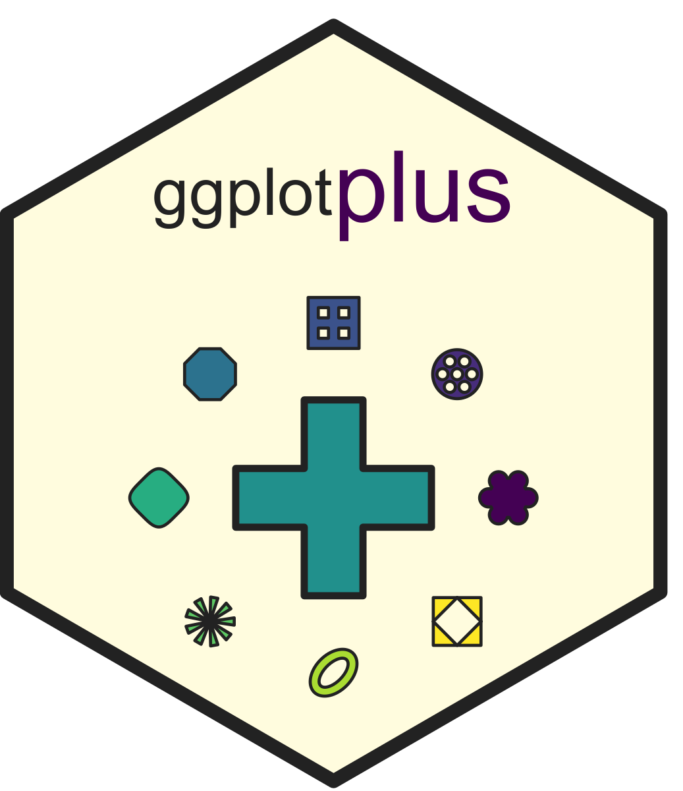

# README
Dr. Alex Bajcz, Quantitative Ecologist, Minnesota Aquatic Invasive
Species Research Center
2026-06-09



# *ggplotplus* – Universal Design additions for *ggplot2*

## Quick Start Guide

To begin using the `ggplotplus` package, you’ll first need to install it
from GitHub using the pak package:

``` r
# install.packages("devtools")  #IF NOT ALREADY INSTALLED
pak::pak("MAISRC/ggplotplus")
```

Then, load it alongside `ggplot2`:

``` r
# install.packages("ggplot2")  #IF NOT ALREADY INSTALLED
library(ggplot2)
library(ggplotplus)
```

Once loaded, you can start layering its `_plus()` tools onto your
`ggplot2` calls to improve their base design with minimal effort.

### Using the tools

To access changes to `ggplot2`’s default design choices related to
default color palettes, common geometry layers, and theme
specifications, just add `theme_plus()` to your `ggplot2` calls:

``` r
ggplot(iris, 
       mapping = aes(x = Petal.Length, 
                     y = Sepal.Length)) +
  geom_point(mapping = aes(color = Species)) + 
  theme_plus() #<--OVERHAULS THEME, GEOM, AND PALETTE RELATED DEFAULTS IN MANY WAYS. 
```


### Taking it a step further

If you want to add thoughtful gridlines, bolster your continuous scales,
and/or move your y-axis title to somewhere more thoughtful, add
`gridlines_plus()`, `scale_continuous_plus()`, and `yaxis_title_plus()`
to your ggplot calls, respective:

``` r
ggplot(iris, 
       mapping = aes(x = Petal.Length, 
                     y = Sepal.Length)) +
  geom_point(mapping = aes(color = Species)) + 
  theme_plus() +
  scale_continuous_plus( #<--OVERHAULS AXIS BREAKS AND LIMITS (FOR CONTINUOUS AXES ONLY!)
    scale = "x",
    name = "Petal length (cm)",
    thin.labels = TRUE) +  
  scale_continuous_plus(
    scale = "y", 
    name = "Sepal length (cm)") +
  yaxis_title_plus() + #<--RELOCATES AND RE-ORIENTS Y AXIS TITLE.
  gridlines_plus() + #<--ADDS THOUGHTFUL GRIDLINES, IF YOU *REALLY* WANT THEM.
  labs(color = expression(italic("Iris")*" species")) #<--THIS IS BASE GGPLOT2, BUT A NICE TOUCH!
```


### Trying out some new shapes

`ggplotplus` also introduces a new palette of shapes designed to be more
distinctive than the base point shapes available in R, accessible using
`geom_point_plus()`:

``` r
ggplot(iris, 
       mapping = aes(x = Petal.Length, 
                     y = Sepal.Length)) +
  geom_point_plus( #<--SWITCH TO THIS FUNCTION TO ACCESS THE NEW SHAPES
    mapping = aes(shape = Species, #<--YOU MUST MAP SHAPE HERE TO A VARIABLE OR CONSTANT
                  fill = Species),
    chosen_shapes = c("squircle", #<--CHOOSE YOUR CUSTOM SHAPES, IF DESIRED.
                      "waffle",
                      "oval")
    ) + 
  theme_plus() +
  scale_continuous_plus(
    scale = "x",
    name = "Petal length (cm)",
    thin.labels = TRUE) +  
  scale_continuous_plus(
    scale = "y", 
    name = "Sepal length (cm)") +
  yaxis_title_plus() +
  gridlines_plus() +
  labs(fill = expression(italic("Iris")*" species"), #<--WE NEED BOTH SCALES TO MATCH IN NAME EXACTLY FOR THEM TO COLLAPSE INTO 1.
       shape = expression(italic("Iris")*" species"))
```


The above graphs demonstrates how `ggplotplus`’s tools rethink the
default design features of `ggplot2`. The intention is to yield a more
opinionated, more universal product more quickly so you can spend less
time fiddling with your graphs than you otherwise might.

However, there’s a *lot* more to know! If you want to dive deeper,
please [check out the full package
guide](https://maisrc.github.io/ggplotplus/).

## Development

`ggplotplus` is currently under active development. Core functions are
expected to remain relatively stable, but some parameters, features, and
default settings may continue to evolve rapidly, and addressing bugs,
inconsistencies, and gaps remains a high priority.

## Acknowledgments

Thanks to Allan Cameron (@Allan Cameron) for answers to Stack Overflow
questions 79654995 and 79682150, which provided key coding elements
enabling the functionality of `yaxis_title_plus()` and
`geom_point_plus()`. Also, many thanks to Dr. Grant Vagle, who
frequently provides testing and feedback on the development of this
package.
